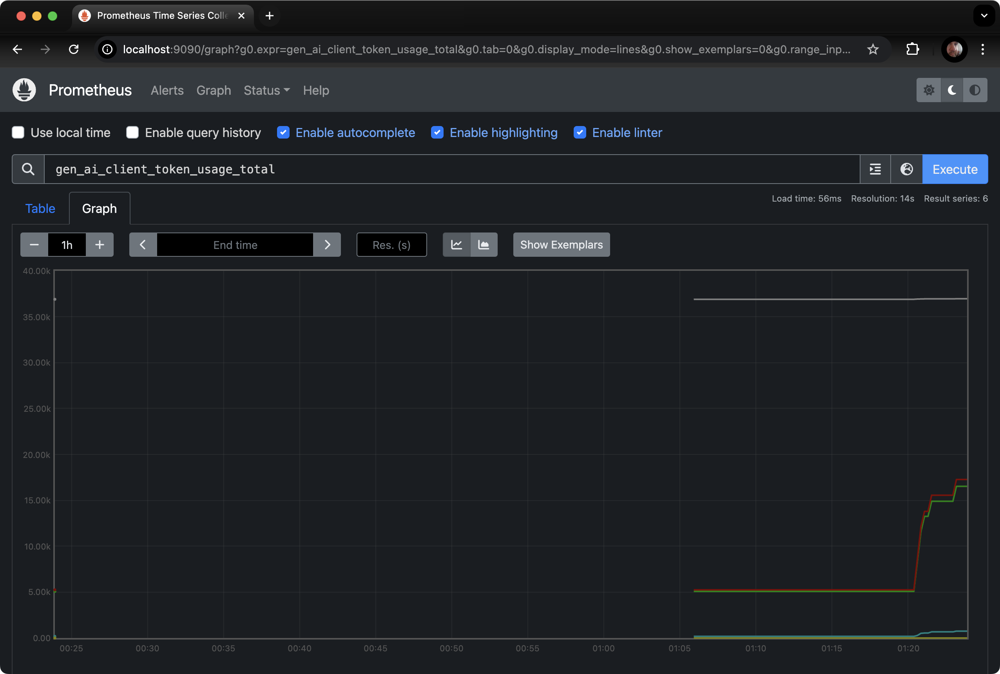
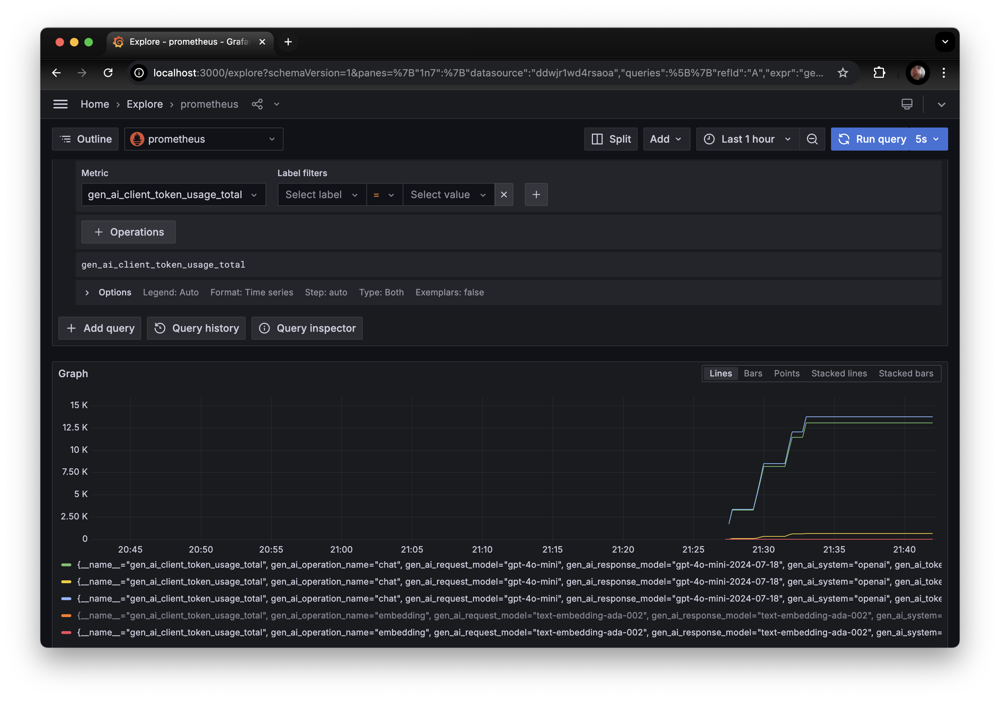

Spring AI RAG Example
---
Simple example to load the entire text of a document into a vector store and
then expose an API through which questions can be asked about the document's
content.

> IMPORTANT: This project has been copied into the
[Spring AI Examples repository](https://github.com/habuma/spring-ai-examples) and will no longer be maintained here.
I'm keeping it here for now, but for future updates, see
the Spring AI Examples repository.

Before running the application, you'll need to acquire an OpenAI API key. Set
the API key as an environment variable named `OPENAI_API_KEY`. E.g.,

```
$ export OPENAI_API_KEY=sk-1234567890abcdef1234567890abcdef
```

You'll also need a document for it to load. Set the `app.resource` property in
src/main/resources/application.properties to the resource URL of the document.
It is set to load the Wikipedia page for the game of Chess, but you can change
it to something else. For example:

```
app.resource=file:///Users/someuser/Spring_in_Action_SixthEdition.pdf
```

By default, `app.resource` is set to load the contents of the Wikipedia page
for the game of Chess.

The resource URL can be a file, classpath, or even an HTTP URL. The file itself
can be any document type supported by Apache Tika, including PDF, Word, HTML,
and more.

The project takes advantage of Spring Boot's Docker Compose support to start a
handful of services, including the Chroma vector database. Be sure to have
Docker Desktop running before starting the application.

Run the application as you would any Spring Boot application. For example, using
Maven:

```
$ mvn spring-boot:run
```

The first time you run it, it will take a little while to load the document into
the vector store (which is a Chroma database in this example).

Then you can use `curl` to ask questions:

```
$ curl localhost:8080/ask -H"Content-type: application/json" -d '{"question": "What playing pieces are there?"}'
```

> The question shown in the example was used to ask questions against my book,
[Spring in Action, 6th Edition](https://www.manning.com/books/spring-in-action-sixth-edition?a_aid=habuma&a_bid=f205d999&chan=habuma).
You'll want to ask questions relevant to whatever document you're using.

Or with HTTPie it's a little easier:

```
http :8080/ask question="What kind of moves can a knight make?"
```

Observability and Tracing
---
This project's Docker Compose file includes services to start Prometheus,
Grafana, and Zipkin, in addition to the Chroma vector database. And the
application's dependencies and configuration enable publication of metrics
through the Actuator's `/actuator/prometheus` endpoint. It is also configured to
sample 100% of requests and to publish tracing to Zipkin.

### Prometheus

After asking at least one question via the `/ask` endpoint, you can view
metrics through Prometheus by opening http://localhost:9090 in a web browser
and choosing one of the metrics published by Spring AI, including:

 - db_vector_client_operation_active_seconds_count
 - db_vector_client_operation_active_seconds_max
 - db_vector_client_operation_active_seconds_sum
 - db_vector_client_operation_seconds_count
 - db_vector_client_operation_seconds_max
 - db_vector_client_operation_seconds_sum
 - gen_ai_client_operation_active_seconds_count
 - gen_ai_client_operation_active_seconds_max
 - gen_ai_client_operation_active_seconds_sum
 - gen_ai_client_operation_seconds_count
 - gen_ai_client_operation_seconds_max
 - gen_ai_client_operation_seconds_sum
 - gen_ai_client_token_usage_total
 - spring_ai_chat_client_operation_active_seconds_count
 - spring_ai_chat_client_operation_active_seconds_max
 - spring_ai_chat_client_operation_active_seconds_sum
 - spring_ai_chat_client_operation_seconds_count
 - spring_ai_chat_client_operation_seconds_max
 - spring_ai_chat_client_operation_seconds_sum

(See https://docs.spring.io/spring-ai/reference/1.0/observabilty/index.html for
a full list of metrics published by Spring AI.)



### Grafana

To see the same metrics in Grafana, open http://localhost:3000 in your web
browser. When prompted to login, use admin for both the username and passowrd.
(You'll be asked to change the password.) Once logged in, create a new Prometheus
connection from the "Connections" menu item. The URL for Prometheus should be
set to http://prometheus:9090 (e.g., the name of the container is the hostname).
Then you can create a graph from any of the metrics published by Spring AI.



### Zipkin

To view tracing open http://localhost:9411 in a web browser. Click on the "Run
Query" button to see a list of all traces. Clicking the "Show" button on any of
the traces will show the full trace details.


